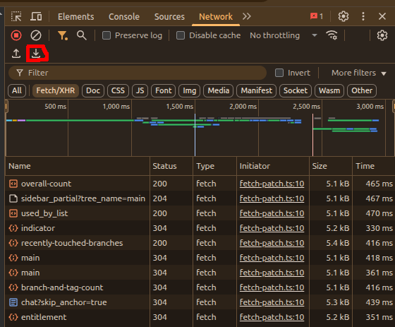

# Harwise Frontend

A modern React web interface for the Harwise CLI tool, providing an intuitive way to process HAR (HTTP Archive) files through a beautiful web application.



## ✨ Features

- 🎯 **Interactive Dashboard** - Overview and quick access to all features
- � **HAR Analytics** - Real-time statistics with visual charts and metrics
- ⚙️ **Multi-format Generation** - Create tests, Insomnia collections, and cURL scripts
- � **File Comparison** - Side-by-side HAR file comparison with detailed diff reports
- 🧪 **Test Execution** - Run generated test suites with visual reports
- 📁 **Drag & Drop Interface** - Easy file uploads with validation
- 💾 **Download Center** - Copy, preview, and download generated content
- 🎨 **Modern UI** - Responsive design with Tailwind CSS
- ⚡ **Real-time Processing** - Live progress indicators and instant feedback

## 🚀 Quick Start

### Prerequisites

- Node.js 20+ 
- npm or yarn
- Backend server running on port 3001

### Installation

```bash
# Install dependencies
npm install

# Start development server
npm run dev

# Open your browser
open http://localhost:3000
```

### Build for Production

```bash
# Build the application
npm run build

# Preview production build
npm run preview
```

## 🏗️ Tech Stack

- **React 18** - Modern React with hooks and functional components
- **TypeScript** - Type-safe development
- **Vite** - Fast development and building
- **Tailwind CSS** - Utility-first CSS framework
- **React Router** - Client-side routing
- **TanStack Query** - Server state management
- **React Dropzone** - File upload with drag & drop
- **Lucide React** - Beautiful SVG icons
- **React Hot Toast** - Toast notifications
- **Axios** - HTTP client for API communication

## 📚 Usage Guide

### 1. Dashboard
The central hub showing an overview of your recent activities and quick access to all features.

### 2. HAR Analytics (Stats)
Upload a HAR file to see detailed statistics including:
- Request count and timing analysis
- HTTP method distribution
- Status code breakdown
- Domain and URL analysis
- Response size metrics
- Performance insights

### 3. File Generation
Transform HAR files into various formats:

#### Test Suites
- Generate Jest/Playwright test files
- Configurable test frameworks
- Automatic assertion generation

#### Insomnia Collections
- Create importable Insomnia workspace files
- Preserve request/response structure
- Environment variable support

#### cURL Scripts
- Generate executable shell scripts
- Batch request processing
- Custom headers and authentication

### 4. File Comparison
Compare two HAR files to identify:
- New or removed requests
- Changed endpoints
- Performance differences
- Header modifications

### 5. Test Execution
Run generated test suites and view:
- Real-time test results
- Pass/fail statistics
- Detailed error reports
- Performance metrics

## 🛠️ Development

### Enhanced Project Structure

```
frontend/
├── src/
│   ├── components/          # Reusable UI components
│   │   ├── FileUpload.tsx   # Drag & drop file handler
│   │   ├── Layout.tsx       # App layout and navigation
│   │   ├── LoadingSpinner.tsx # Loading indicators
│   │   └── ResultsDisplay.tsx # Content viewer
│   ├── pages/              # Route components
│   │   ├── Dashboard.tsx   # Main dashboard
│   │   ├── Compare.tsx     # File comparison
│   │   ├── Generate.tsx    # Content generation
│   │   ├── Stats.tsx       # Analytics view
│   │   └── Test.tsx        # Test execution
│   ├── services/           # External integrations
│   │   └── api.ts          # Backend API client
│   ├── App.tsx             # Root component
│   └── main.tsx           # Application entry point
├── public/                 # Static assets
└── package.json           # Dependencies and scripts
```

### Key Components

#### FileUpload Component
Handles drag & drop file uploads with validation:
- Accepts only .har files
- Visual drag feedback
- Error handling and user feedback
- Integration with all major features

#### ResultsDisplay Component
Multi-format content viewer supporting:
- JSON with syntax highlighting
- Markdown rendering
- HTML preview
- Plain text display
- Copy to clipboard functionality
- File download options

#### API Service
Centralized backend communication:
- Type-safe API calls
- Error handling and retry logic
- File upload with progress tracking
- Response transformation

### Available Scripts

```bash
# Development
npm run dev          # Start dev server with hot reload
npm run dev:host     # Start dev server accessible on network

# Building
npm run build        # Build for production
npm run preview      # Preview production build locally

# Code Quality
npm run lint         # Check code with ESLint
npm run type-check   # Verify TypeScript types
```

## 🔧 Configuration

### Environment Variables

Create a `.env.local` file for local development:

```bash
# API Configuration
VITE_API_BASE_URL=http://localhost:3001

# Development Settings
VITE_DEV_MODE=true
```

### Tailwind Configuration

The project uses a custom Tailwind configuration (`tailwind.config.js`) with:
- Extended color palette
- Custom component classes
- Responsive breakpoints
- Animation utilities

## 🚀 Deployment

### Production Build

```bash
# Create optimized build
npm run build

# The dist/ folder contains the production files
# Serve with any static file server
```

### Docker Deployment

```dockerfile
FROM node:20-alpine as builder
WORKDIR /app
COPY package*.json ./
RUN npm ci
COPY . .
RUN npm run build

FROM nginx:alpine
COPY --from=builder /app/dist /usr/share/nginx/html
EXPOSE 80
```

### Environment-Specific Builds

For different environments, use environment variables:

```bash
# Production
VITE_API_BASE_URL=https://api.harwise.com npm run build

# Staging
VITE_API_BASE_URL=https://staging-api.harwise.com npm run build
```

## 🤝 Contributing

1. Fork the repository
2. Create a feature branch: `git checkout -b feature/amazing-feature`
3. Commit your changes: `git commit -m 'Add amazing feature'`
4. Push to the branch: `git push origin feature/amazing-feature`
5. Open a Pull Request

### Development Guidelines

- Use TypeScript for all new files
- Follow existing component patterns
- Add proper error handling
- Include responsive design considerations
- Test with various HAR file sizes
- Maintain accessibility standards

## 🐛 Troubleshooting

### Common Issues

**Build Errors:**
- Ensure Node.js version 20+
- Clear node_modules and reinstall
- Check for TypeScript errors

**API Connection Issues:**
- Verify backend server is running on port 3001
- Check CORS configuration
- Validate API endpoint URLs

**File Upload Problems:**
- Confirm file is valid HAR format
- Check file size limits
- Verify browser JavaScript is enabled

### Performance Optimization

For large HAR files:
- Files are processed on the backend
- Results are streamed when possible
- Loading indicators provide feedback
- Error boundaries prevent crashes

## 📄 License

This project is part of the Harwise CLI tool. See the main project LICENSE file for details.

## Project Structure

```
src/
├── components/     # Reusable UI components
│   └── Layout.tsx  # Main layout with navigation
├── pages/          # Page components
│   ├── Dashboard.tsx
│   ├── Compare.tsx
│   ├── Generate.tsx
│   ├── Stats.tsx
│   └── Test.tsx
├── App.tsx         # Main app component with routing
├── main.tsx        # Entry point
└── index.css       # Global styles
```

## API Integration

The frontend communicates with a backend server (port 3001) that wraps the Harwise CLI functionality. API calls are proxied through Vite's dev server.

## Next Steps

1. Install dependencies and run the development server
2. Implement backend API server
3. Add file upload functionality
4. Build individual feature components
5. Add real-time progress tracking
6. Implement results visualization